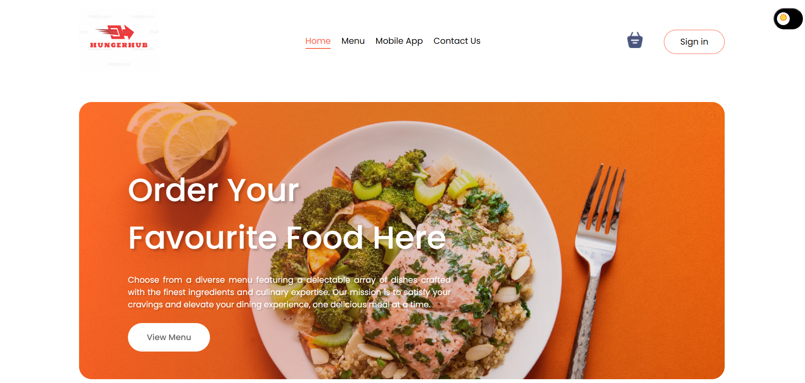

# HungerHub  
[HungerHub Live](https://hungerhub.vercel.app/)

HungerHub is your go-to food delivery platform, offering a seamless experience to explore, order, and enjoy your favorite meals from local restaurants. Fast, reliable, and always fresh, we bring delicious food right to your doorstep. Join us and satisfy your cravings with ease!  

## Features  
- **Explore Local Restaurants**: Browse through a curated list of restaurants in your area.  
- **Order with Ease**: Enjoy an intuitive and user-friendly interface for placing orders.  
- **Reliable Delivery**: Get your meals delivered fresh and on time.  

## Technologies Used  
- **Frontend**: React with Vite for a fast and modern development experience.  
- **Routing**: React Router for seamless navigation.  

## Getting Started  

Follow these steps to set up and run the project locally.  

### Prerequisites  
Ensure you have the following installed:  
- [Node.js](https://nodejs.org/) (v14 or higher)  
- npm (comes with Node.js)  

### Installation  

1. Clone the repository:  
   ```bash  
   git clone https://github.com/pornima25s/full-stack-task-management-app.git .  

Navigate to the frontend directory:
cd frontend  

Install dependencies:
npm install  

Install React Router:
npm install react-router-dom  

## How to Run: 
Start the development server:
npm run dev 

Open your browser and navigate to:
http://localhost:5173  

You will see the HungerHub application running. Explore the app to browse local restaurants, place orders, and enjoy a seamless food delivery experience.


[Watch the demo video](./src/screenshots/ScreenRecording.mp4)



Deployment
HungerHub is deployed on Vercel and can be accessed at the following link:
👉 [HungerHub Live](https://hungerhub.vercel.app/)

Enjoy your meal with HungerHub! 🍔🍕🌮